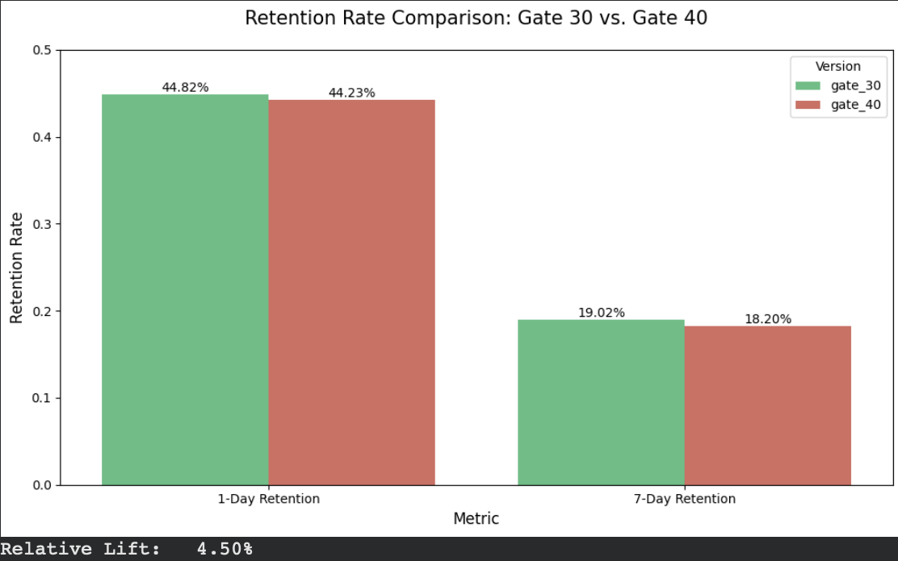
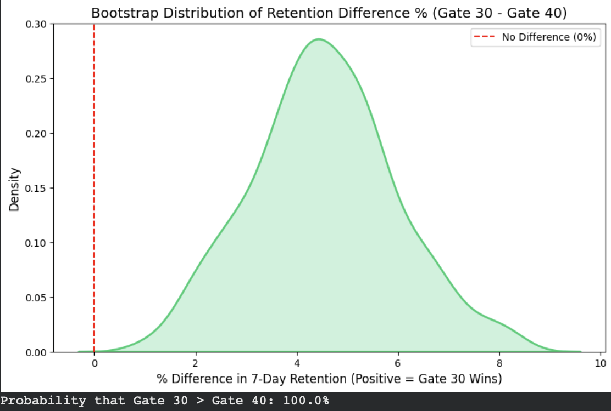

# Optimizing Mobile Game Retention: Gate 30 vs. Gate 40 (A/B Testing)

## Project Overview
This project analyzes the impact of moving the first "gate" in the mobile puzzle game **Cookie Cats** from Level 30 to Level 40. A gate is a mandatory pause where players must wait or make an in-app purchase to progress.

The goal is to determine which gate placement leads to better **player retention** and **game engagement**.

* **The Hypothesis:** Moving the gate later (to Level 40) might allow players to get more "hooked," thereby improving retention.
* **The Result:** The data proved the opposite. **Gate 30 performed significantly better.**

## Data Source
The dataset used in this project is sourced from [Kaggle - Mobile Games A/B Testing - Cookie Cats](https://www.kaggle.com/datasets/mursideyarkin/mobile-games-ab-testing-cookie-cats).
* **Sample Size:** 90,189 players
* **Format:** CSV (Included in `data/` folder for reproducibility)

## Technologies & Methods
* **Language:** Python
* **Libraries:** Pandas, Scipy, Statsmodels, Matplotlib, Seaborn
* **Statistical Methods:**
    * **Bootstrap Analysis** (to visualize uncertainty)
    * **Z-Test** (for hypothesis testing)
    * **Relative Lift Calculation** (for business impact)

## Key Findings

### 1. Retention Analysis (Primary KPI)
We observed a statistically significant improvement in retention when the gate was placed at Level 30.
* **1-Day Retention:** **19.0%** (Gate 30) vs 18.2% (Gate 40)
* **7-Day Retention:** **4.5% Relative Lift** (Gate 30 performed better)
* **Conclusion:** Forcing an early break prevents "burnout" and sustains long-term interest.

### 2. Statistical Confidence (Bootstrap Analysis)
To confirm this result wasn't due to random chance, we performed a Bootstrap analysis with 500 samples.
* **Result:** Gate 30 had a higher retention rate in **>99%** of the simulations.
* **Conclusion:** We can say with near 100% confidence that the difference is real and statistically significant.

### 3. Engagement (Secondary Metric)
* **Game Rounds:** The average game rounds per user remained **stable** (approx. 51 rounds for both groups).
* **Insight:** The Gate 30 restriction improved retention **without negatively impacting player activity**. This indicates a "healthy win"—we retained more users without reducing their engagement levels.

## Business Impact & Recommendation
Based on the analysis, I recommend **keeping the gate at Level 30**.

1.  **Prevent Churn:** Implementing Gate 30 prevents a **~4.5% drop** in the long-term user base.
2.  **Maximize LTV:** Higher retention is a leading indicator for higher Lifetime Value (LTV).
3.  **Ad Revenue Potential:** Since engagement (rounds played) remained stable, the increased retention translates directly to more daily sessions and ad impressions over the player's lifetime.
